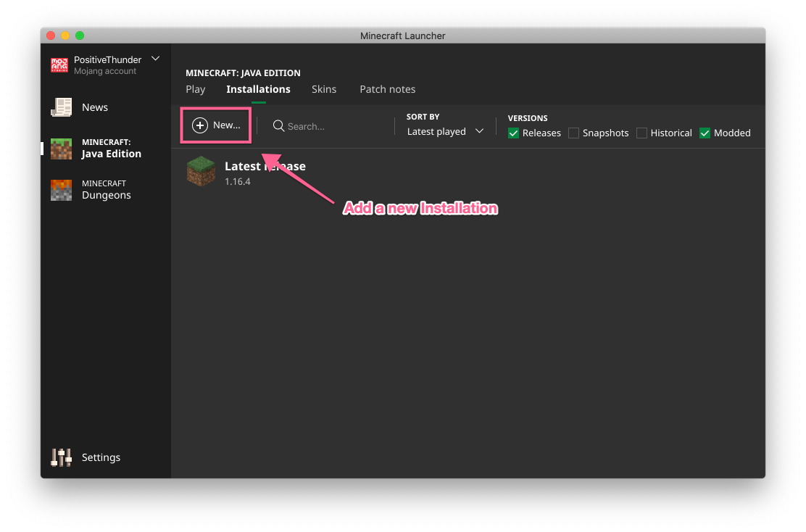

# Introduction

This utility has been made for those who are new to Minecraft, or new to 
installing the Better Than Wolves mod. This installer has been developed 
to work with the latest Minecraft launcher has been tested on both 
Windows and MacOS.

Minecraft supports multiple "Configurations", which can be set to use
a specific version of the Minecraft binary files. This installer will copy
an existing configuration and apply the Better Than Wolves patch to it.

If you want to know how to remove the mod, see the 
[Removal Instructions](Remove.MD).

## Before You Start

Before you can use this utility you need to have the following set up:

* **[Java](https://java.com/en/download/)** - the utility requires a 
Java 8 to work

* **[Latest Patch](http://www.sargunster.com/btwforum/viewforum.php?f=3)** - Download the latest version of the Better Than Wolves
patch from the Better Than Wolves Forum post.

* **A Minecraft 1.5.2 configuration** -  Better Than Wolves requires a 
Minecraft 1.5.2 configuration which this installer will look for as part of 
installation. If you have not already created this release please see 
the section on [creating a new profile](New-Profile.MD).

## Download and Run

To use the installer, download the [installer.jar](https://github.com/rwapshott/btw-installer/blob/master/installer.jar) 
from the BitBucket release page.

If your system supports running Java Executable files then you can 
double click the file to start the installer. Otherwise you can 
start the installer by using a terminal or command prompt:

```bash
$ cd Downloads
$ java -jar installer.jar
```

## Patch Installation

The utility will guide you through the installation process. To start this 
process, press the "Patch" button.


**Select Minecraft Installation**

If you are happy to install the patch into the default Minecraft location
then select "Yes".


Otherwise you will need to use the folder chooser dialog to select where
Minecraft is installed.

**Select Better Than Wolves Download**

Then you will need to select the downloaded BetterThanWolves zip file which you 
can download from the Better Than Wolves Forum [here](http://www.sargunster.com/btwforum/viewforum.php?f=3).


Then the utility will create a new release called "BetterThanWolves" which will
be a copy of the 1.5.2 release with the BetterThanWolves patch merged in.


Installation is now complete.

## Create BetterThanWolves Configuration

Now we can create a new Configuration which uses the Better Than Wolves
version.

1) From the Minecraft Launcher, select the "Launch Options" tab:


2) Add a new configuration with the "Add New" button.



3) Fill in the configuration as follows:

- Name: "BetterThanWolves"
- Version: release BetterThanWolves
- Game Directory: Choose a location other than the default Mincraft location

**Note:** The Game Directory seems important, as we noticed that if 
BetterThanWolves is started in a Game Directory that has been used for
a later version of the game, it will fail. 


4) Once you have made these changes, click "Save".

## Launch

You are now ready to launch the game, with the BetterThanWolves mod 
installed.


Now go punch a tree!