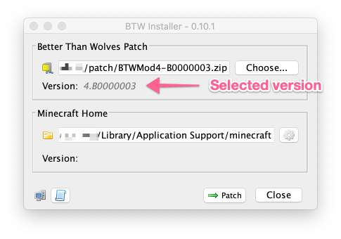
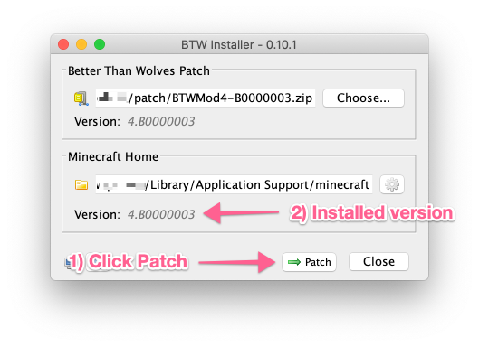

# Introduction

This utility has been made for those who are new to Minecraft, or new to 
installing the Better Than Wolves mod. This installer has been developed 
to work with the latest Minecraft launcher has been tested on both 
Windows, MacOS and Linux (Ubuntu).

Minecraft supports multiple "Configurations", which can be set to use
a specific version of the Minecraft binary files. This installer will 
create a new configuration called "BetterThanWolves" which will contain
the Minecraft 1.5.2 client with the Better Than Wolves patch applied 
to it.

This project is provided as is, and is licensed under a MIT license. 
For more details and other acknowledgements see [here](Extra.MD).

Virus scan provided by [VirusTotal.com](https://www.virustotal.com/#/file/ce6c84625790d6a05e74d819210223eb8eb4d135cdd71c1e06c83c1aa6ca7034/detection)
and malware scan by [Jotti](https://virusscan.jotti.org/en-GB/filescanjob/ij2bfsxzur).

## Before You Start

Before you can use this utility you will the following:

* **[Java](https://java.com/en/download/)** - the installer requires a 
Java 8 or greater to work.

* **[Latest Patch](http://www.sargunster.com/btwforum/viewforum.php?f=3)** - Download the latest version of the Better Than Wolves
patch from the Better Than Wolves Forum.

## Download and Run

To use the installer, download the [installer.jar](https://github.com/rwapshott/btw-installer/releases/download/latest/installer.jar) 
from the GitHub release page.

If your system supports running Java Executable files then you can 
double click the file to start the installer. Otherwise you can 
start the installer by using a terminal or command prompt:

```bash
$ cd Downloads
$ java -jar installer.jar
```

## Patch Installation

The utility will guide you through the installation process.

1) **Select Better Than Wolves Patch**

Then select the downloaded Better Than Wolves zip file which you 
can download from the Better Than Wolves Forum [here](http://www.sargunster.com/btwforum/viewforum.php?f=3).


The selected version will be shown in the version field.



2) **Choose "Patch" to install this version**

The utility will create a new Configuration called "BetterThanWolves" which 
will be a copy of the 1.5.2 client with the BetterThanWolves patch merged in.



Installation is now complete.

## Create BetterThanWolves Configuration

Now we can create a new Configuration which uses the Better Than Wolves
version.

1) From the Minecraft Launcher, select the "Launch Options" tab:


2) Add a new configuration with the "Add New" button.


3) Fill in the configuration as follows:

- **Name**: "BetterThanWolves"
- **Version**: release BetterThanWolves
- **Game Directory**: Choose a location other than the default Minecraft location

**Note:** The Game Directory location cannot be the Minecraft
default as 1.5.2 is not compatible with the latest Minecraft layout. If
BetterThanWolves fails to start, check that this is correctly set.


4) Once you have made these changes, click "Save".

## Launch

You are now ready to launch the game, with the BetterThanWolves mod 
installed.


Now go punch a tree!