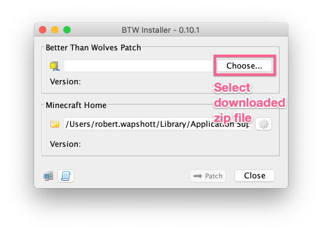

# Introduction

This utility has been made to simplify the process of installing the 
[Better Than Wolves Mod](https://sargunster.com/btw). Whether you are 
a new player looking to get into this mod, or an experience player who 
has punched many trees, this utility should help with the installation
process. 

This installer and guide have been developed to work with the latest 
Minecraft launcher (2020) has been tested on Windows, MacOS and Linux 
(Ubuntu).

This project has been provided as is, and is licensed under a MIT license. 
For more details and other acknowledgements see [here](docs/Extra.MD).

Virus scan provided by [VirusTotal.com](https://www.virustotal.com/#/file/ce6c84625790d6a05e74d819210223eb8eb4d135cdd71c1e06c83c1aa6ca7034/detection)
and malware scan by [Jotti](https://virusscan.jotti.org/en-GB/filescanjob/ij2bfsxzur).

## How the Installer Works

Minecraft supports multiple "Installations", which can be set to use
a specific version of the Minecraft client files. This installer will 
create a new configuration called "BetterThanWolves" which will contain
the Minecraft 1.5.2 client which has been patched by the user provided
Better Than Wolves patch.

## Before You Start

Before you can use this utility you will the following:

* **[Java](https://java.com/en/download/)** the installer requires a 
Java 8 or greater to work.

* **[Latest Patch](http://www.sargunster.com/btwforum/viewforum.php?f=3)** 
Download the latest version of the Better Than Wolves patch from the Better 
Than Wolves Forum.

## Download and Run

To use the installer, download the [installer.jar](https://github.com/GencoreOperative/btw-installer/releases/download/latest/installer.jar) 
from the GitHub release page.

If your system supports running Java Executable files then you can double-click 
the file to start the installer. Alternatively, we can start the application 
from the command prompt:

```bash
$ cd Downloads
$ java -jar installer.jar
```

## Patch Installation

The utility will guide you through the installation process.

1) **Ensure the Minecraft Launcher is not running**

The patching process will add a new version to the Minecraft installation
folder. The Minecraft Launcher will only pick this up when it is started.

2) **Select Better Than Wolves Patch**

Then select the downloaded Better Than Wolves zip file.



The selected version will be shown in the version field.


3) **Choose "Patch" to install this version**

The utility will create a new Configuration called "BetterThanWolves" which 
will be a copy of the 1.5.2 client with the BetterThanWolves patch merged in.


Installation is now complete.

## Create BetterThanWolves Installation

Now we can create a new Installation which uses the Better Than Wolves
version.

1) From the Minecraft Launcher, select the "Installation" tab:


2) Add a new Installation with the "+ New..." button.


3) Fill in the configuration as follows:

- **Name**: "BetterThanWolves"
- **Version**: release BetterThanWolves
- **Game Directory**: Leave Blank

**Note:** Due to an [Issue](docs/Issues.MD) with save game files not appearing
when using a different "Game Directory", we recommend instead using the default
Minecraft installation folder.


4) Once you have made these changes, click "Save".

## Launch

You are now ready to launch the game, with the BetterThanWolves mod 
installed.


When the game starts you will see a visual confirmation that the mod has been
loaded by looking for a status message at the bottom left of the screen.


Now go punch a tree!