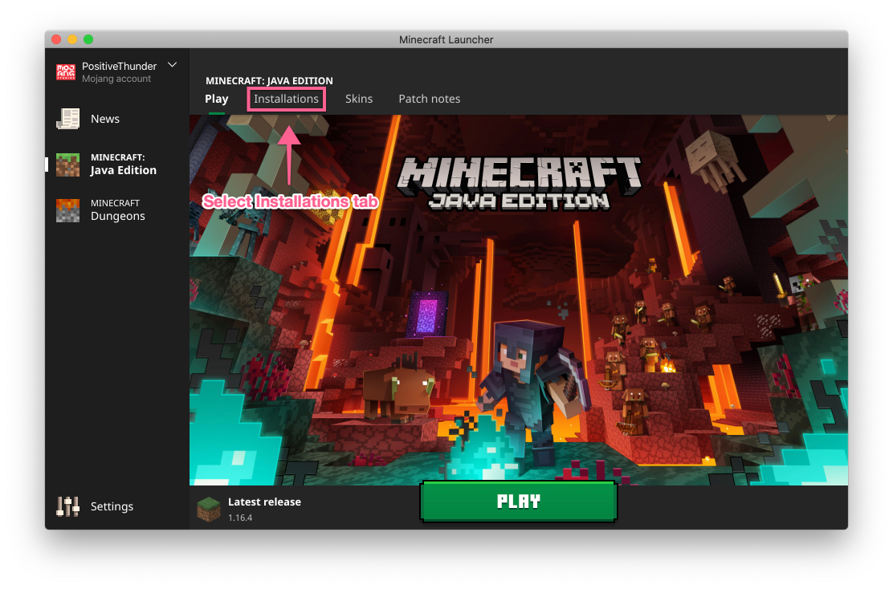

# Introduction

This utility has been made for those who are new to Minecraft, or new to 
installing the Better Than Wolves mod. It has been developed with the latest
Minecraft launcher has been tested on Windows and MacOS.

## Before You Start

Before you can use this utility you need to have the following things setup:

* **[Java](https://java.com/en/download/)** - the utility requires a Java 8 
JRE or JDK to work

* **A Minecraft 1.5.2 configuration** -  Better Than Wolves is based on Minecraft 
1.5.2. This utility will look for this release as part of installation. If you 
have not already created this release please see the section on 
[creating a new profile](New-Profile.MD).

## Download and Run

Run the utility by downloading the [latest release](http://github.com) from the
Github release page. Start by opening a command prompt or terminal and 
selecting the folder where the utility was downloaded to. In this case we
have downloaded it to `Downloads`:

```bash
$ cd Downloads
$ java -jar patcher.jar
```

## Patch Installation

The utility will guide you through the installation process. To start this 
process, press the "Patch" button. First you will need to select your 
Minecraft installation folder:


Then you will need to select the downloaded BetterThanWolves zip file which you 
can download from [here](http://www.minecraftforum.net/forums/mapping-and-modding/minecraft-mods/1272992-better-than-wolves-now-with-bloody-stumps-total).


Then the utility will create a new release called "BetterThanWolves" which will
be a copy of the 1.5.2 release with the BetterThanWolves patch merged in.


Installation is now complete.

## Create BetterThanWolves Configuration

Now we can create a new Configuration in the Minecraft launcher. Select the
"Launch Options" tab from the launcher.



Add a new configuration with the "Add New" button.


Fill in the configuration as follows:

- Name: "BetterThanWolves"
- Version: release BetterThanWolves
- Game Directory: Choose a location other than the default Mincraft location

**Note:** The Game Directory seems important, as we noticed that if 
BetterThanWolves is started in a Game Directory that has been used for
a later version of the game, it will fail. 


Once you have made these changes, click "Save".

## Launch

You are now ready to launch the game, with the BetterThanWolves mod 
installed.


Now go punch a tree!