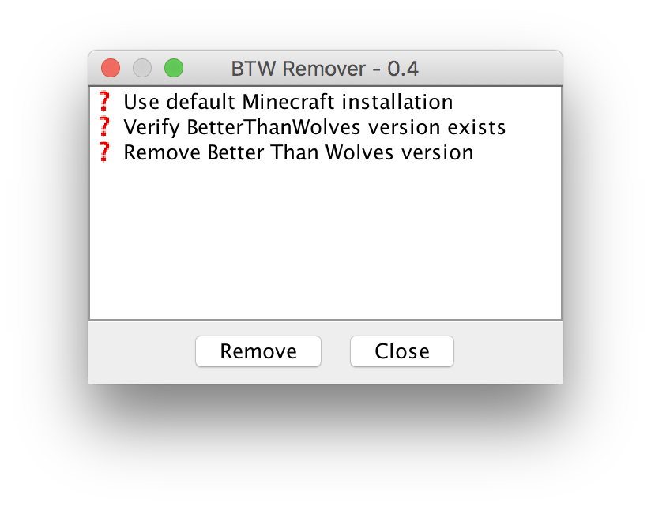
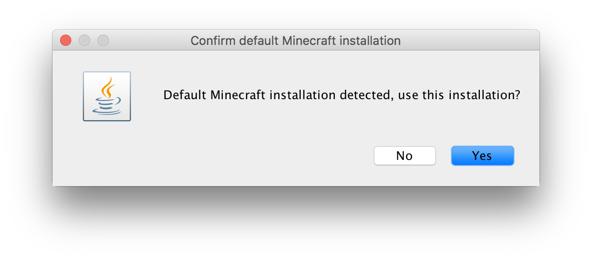
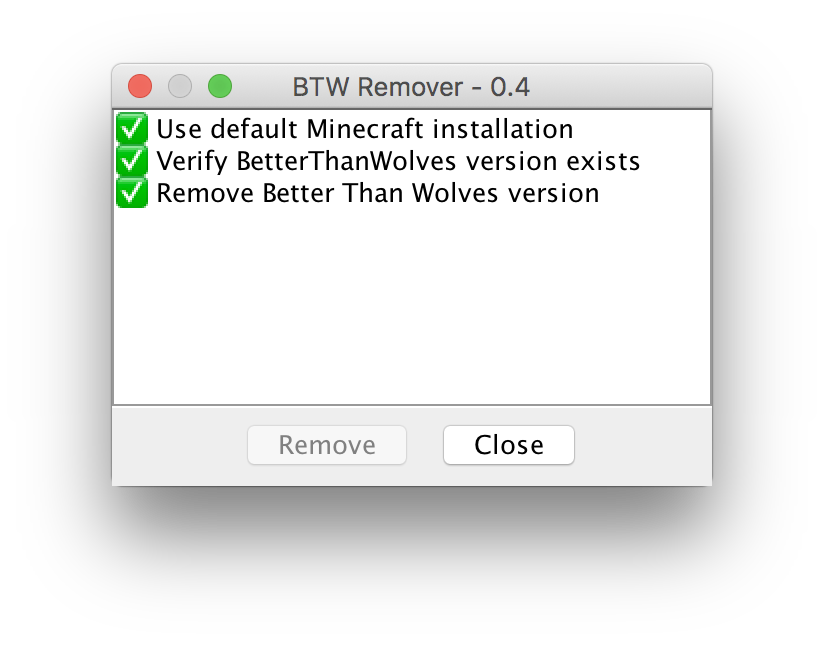

# Removal of Better Than Wolves

If you decide you have had enough of Better Than Wolves, this
installer supports removing of the patch when launched with a 
specific command line argument provided.

1) From Command Prompt or Terminal, run the [installer.jar](https://bitbucket.org/rwapshott/btw-installer/downloads/installer.jar)
with the following argument:

```bash
$ cd Downloads
$ java -jar installer.jar --remove
```

This will launch the utility in remove mode.

2) Click "Remove" to start the process.



3) Confirm the default Minecraft installation folder if this is what
you selected when installing the mod. Otherwise choose where Mincraft
is installed.



4) Complete.

